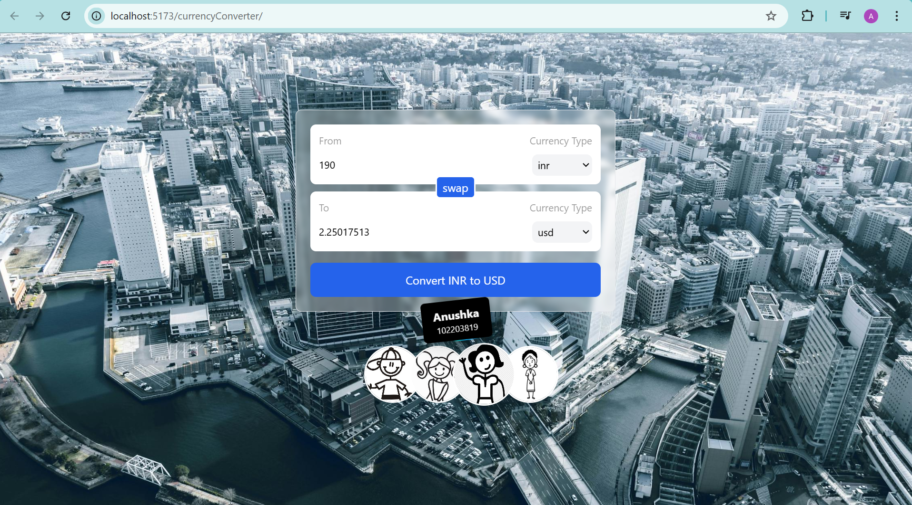

# Currency Converter Website

Project Overview

The Currency Converter Website is a modern, Vite-based React application designed to provide Real-time currency conversion. With a sleek, responsive interface built using Tailwind CSS, the application ensures a seamless user experience across all devices. It integrates DevOps practices through Docker and Jenkins for containerization and CI/CD automation. The project is hosted publicly via GitHub Pages, making it accessible to users globally.

Key Features :

Real-Time Currency Conversion: Convert between multiple currencies with up-to-date exchange rates.

Responsive Design: Built with Tailwind CSS, the app adapts seamlessly to mobile, tablet, and desktop devices.

Vite-Powered Setup: Utilizes Vite for lightning-fast builds and development.

GitHub Pages Deployment: Hosted on GitHub Pages for free and public access.

Dockerized Environment: Ensures consistent development and production environments using Docker.

CI/CD with Jenkins: Automates build, testing, and deployment processes using Jenkins.

Tech Stack :

Frontend: React.js (Vite), HTML, JavaScript

Styling: Tailwind CSS

Build Tool: Vite

Hosting: GitHub Pages

DevOps Tools: Docker,Jenkins

Version Control: Git and GitHub

Project Setup

Prerequisites :

Node.js and npm installed

Docker installed

Jenkins installed (for CI/CD)

Team Contribution :

Abhay: Developed the frontend using Vite, React, and Tailwind CSS, and deployed vite based react website on GitHub Pages.

Tamanna: Contributed to frontend development using vite, enhancing UI/UX and styling with Tailwind CSS, made the presentation.

Anushka: Dockerized the application for consistent environments and documented the project setup.

Akshita: Configured Jenkins pipelines for automated build, test, and deployment workflows.

Screenshots of Website 

